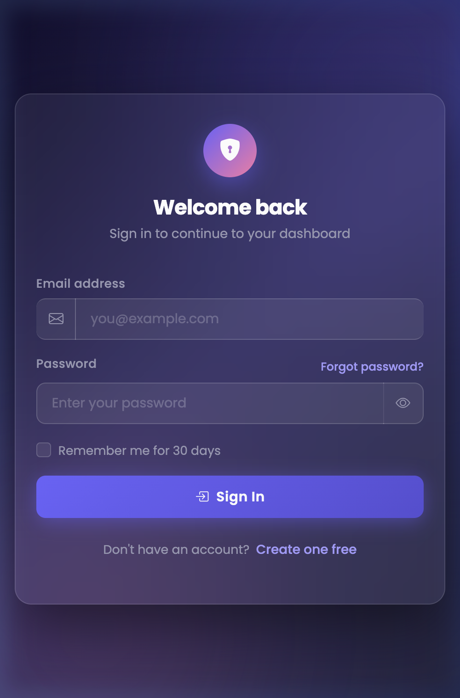
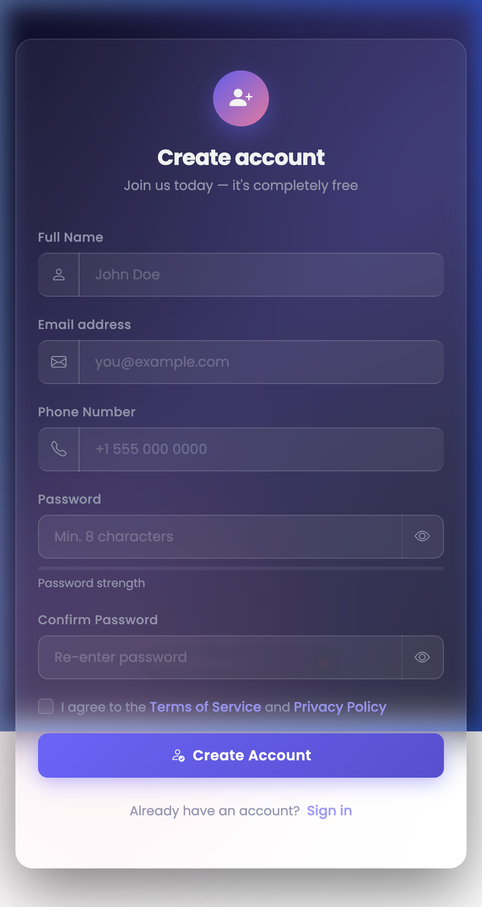
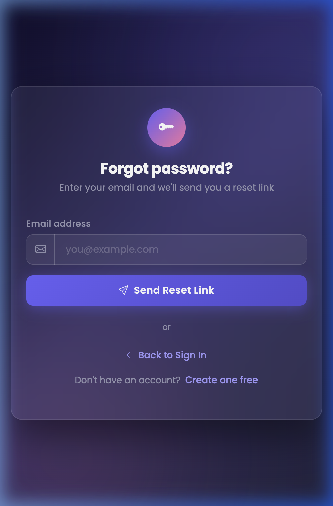
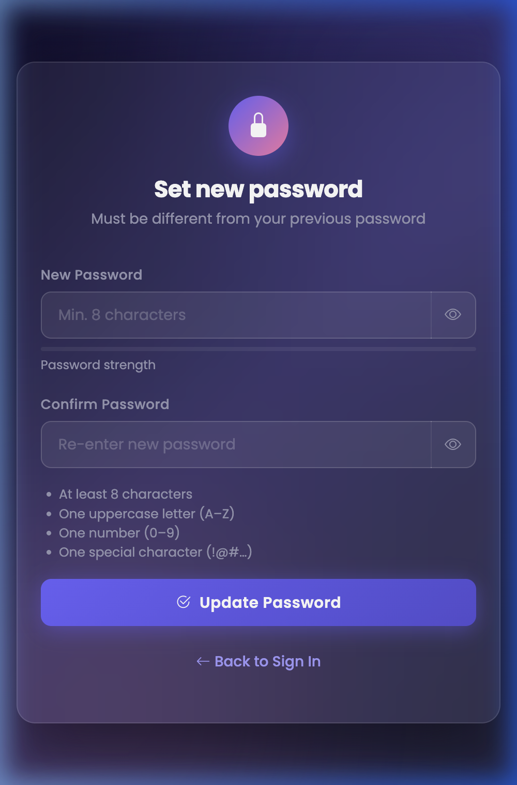
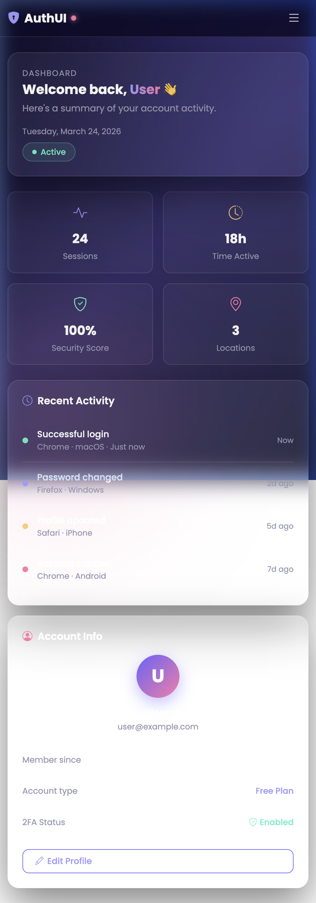

# AuthUI — Authentication System Styled

A modern, fully responsive authentication system built with **Bootstrap 5** and custom CSS. Features a sleek dark glassmorphism theme with smooth animations, form validation, and all standard authentication flows.



---

## 🚀 Features

- ✅ **Bootstrap 5** — full integration (grid, utilities, components, navbar)
- ✅ **Bootstrap Icons** — icon set used throughout all pages
- ✅ **Google Fonts (Poppins)** — premium typography
- ✅ **Glassmorphism UI** — backdrop-filter, translucent cards
- ✅ **Dark gradient background** — deep indigo/violet palette
- ✅ **Password visibility toggle** — on all password fields
- ✅ **Password strength meter** — real-time scoring with color feedback
- ✅ **Password requirements checklist** — live checked items
- ✅ **Form validation** — client-side with visual feedback (is-valid / is-invalid)
- ✅ **Loading spinner** — on all form submit buttons
- ✅ **Smooth animations** — card entrance, hover effects, orb floats
- ✅ **Fully responsive** — desktop, laptop, tablet, and mobile
- ✅ **Bootstrap Navbar** — with app name (left) and logout button (right)
- ✅ **Dashboard UI** — stat cards, activity feed, account info panel

---

## 🛠 Tech Stack

| Technology        | Purpose                          |
|-------------------|----------------------------------|
| HTML5             | Page structure & semantics       |
| Bootstrap 5.3.3   | Layout, components, utilities    |
| Bootstrap Icons   | Icon library                     |
| Custom CSS        | Dark theme, glassmorphism, hover |
| Google Fonts      | Poppins font family              |
| Vanilla JavaScript| Form validation, toggling, UX    |

---

## 📁 Folder Structure

```
authentication-system-styled/
├── index.html            # Login page
├── register.html         # Registration page
├── forgot-password.html  # Forgot password page
├── reset-password.html   # Reset password page
├── dashboard.html        # User dashboard
├── styles.css            # Custom CSS (theme, animations)
├── README.md             # Project documentation
└── screenshots/
    ├── login.png
    ├── register.png
    ├── forgot-password.png
    ├── reset-password.png
    └── dashboard.png
```

---

## 🔗 Page Navigation Flow

```
index.html (Login)
    ├── → register.html        (Create Account link)
    ├── → forgot-password.html (Forgot Password link)
    └── → dashboard.html       (on successful login)

register.html
    └── → dashboard.html       (on successful registration)

forgot-password.html
    └── → index.html           (auto-redirect after 3s / Back link)

reset-password.html
    └── → index.html           (auto-redirect after 2.5s)

dashboard.html
    └── → index.html           (Logout button)
```

---

## ▶️ How to Run

No build tools or server required — this is a pure HTML/CSS/JS project.

### Option 1: Open directly in browser
```bash
# Clone or download the project
cd authentication-system-styled
open index.html       # macOS
start index.html      # Windows
xdg-open index.html  # Linux
```

### Option 2: Use VS Code Live Server
1. Install the **Live Server** extension in VS Code
2. Right-click `index.html` → **Open with Live Server**

### Option 3: Python HTTP Server
```bash
cd authentication-system-styled
python3 -m http.server 5500
# Visit: http://localhost:5500
```

---

## 📸 Screenshots

| Page              | Preview                                      |
|-------------------|----------------------------------------------|
| Login             |               |
| Register          |         |
| Forgot Password   |    |
| Reset Password    |      |
| Dashboard         |       |

---

## 🎨 Design System

| Token              | Value                     |
|--------------------|---------------------------|
| Primary            | `#6C63FF` (indigo)        |
| Accent             | `#fd79a8` (pink)          |
| Background         | `#0f0c29 → #302b63`       |
| Card background    | `rgba(255,255,255,0.06)`  |
| Text (light)       | `#e4e4f0`                 |
| Text (muted)       | `#9898b3`                 |
| Border radius card | `18px`                    |
| Font               | Poppins, sans-serif       |

---

## 📋 Key Bootstrap Components Used

- `navbar`, `navbar-brand`, `navbar-toggler`, `collapse`
- `card` pattern (custom `.auth-card`)
- `form-control`, `form-label`, `form-check`, `form-check-input`
- `input-group`, `input-group-text`
- `invalid-feedback`, `valid-feedback`
- `spinner-border`, `spinner-border-sm`
- `container`, `row`, `col-*`, `g-*`
- Bootstrap utility classes: `d-flex`, `mb-3`, `mt-*`, `gap-*`, etc.

---

## 👨‍💻 Author

Built as part of an Authentication System Styling assignment.  
Stack: HTML5 · Bootstrap 5 · Custom CSS · Vanilla JS

---

*Ready for GitHub submission. ⭐*
